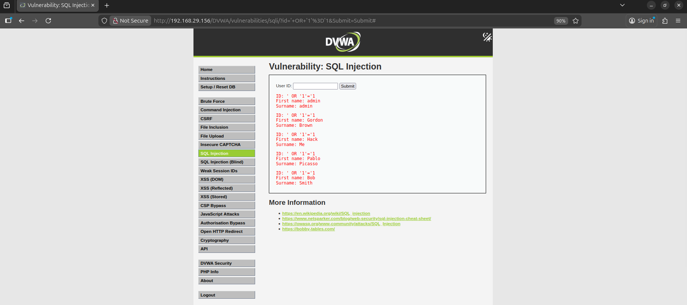

# 🛡️ SOC Automation Project: Web Application Defense Lab


📄 **[Download Full Lab Report (PDF)](SOC_Lab_Report.pdf)**

---

## 📌 Executive Summary
This project demonstrates the design and implementation of a **Security Operations Center (SOC)** workflow to detect and mitigate web-based cyber threats. The objective was to secure a vulnerable web server against OWASP Top 10 attacks, specifically **SQL Injection (SQLi)**.

The architecture integrates **ModSecurity (WAF)** for network-level filtering and **Wazuh (SIEM)** for centralized log analysis. The project successfully demonstrates the "Attack-Detect-Defend" lifecycle, culminating in the automated blocking of malicious traffic without modifying the application code.

---

## 🏗️ Lab Architecture
The environment uses a Manager-Agent architecture deployed on virtualized infrastructure.

```mermaid
graph TD;
    Attacker[Windows 10 (Attacker)] --"SQL Injection Payload"--> Victim[Ubuntu Server (DVWA)];
    Victim --"Apache Logs"--> ModSec[ModSecurity WAF];
    ModSec --"Alerts (Log Analysis)"--> WazuhAgent[Wazuh Agent];
    WazuhAgent --"Forwarded Events"--> WazuhManager[Wazuh SIEM];
    WazuhManager --"Level 12 Alert"--> Dashboard[Kibana Dashboard];
### 🛠️ Technologies Used
* **SIEM:** Wazuh (Manager & Agent)
* **WAF:** ModSecurity + OWASP Core Rule Set (CRS)
* **Target System:** Ubuntu Server hosting DVWA (Damn Vulnerable Web App)
* **Attacker System:** Windows 10 (Browser-based SQL Injection)

---

## 📸 Project Walkthrough

### Phase 1: Vulnerability Assessment (Red Team)
I deployed a LAMP stack server hosting the **Damn Vulnerable Web App (DVWA)**. By injecting the SQL payload `' OR '1'='1` into the User ID input field, I successfully bypassed the application's authentication logic and dumped the entire list of database users.


*Evidence of successful SQL Injection dumping the database user list.*

---

### Phase 2: SIEM Integration & Custom Rules (Blue Team)
I installed **ModSecurity** to monitor HTTP traffic. However, the default Wazuh configuration treated WAF warnings as low-priority events. To fix this, I analyzed the log format and wrote a **Custom XML Rule (ID 100100)** to elevate specific SQL Injection events to **Critical Severity**.

**Custom Rule Logic:**
```xml
<rule id="100100" level="12">
  <if_sid>30401</if_sid>
  <match>SQL Injection</match>
  <description>WAF Critical: SQL Injection Attack Detected</description>
  <group>modsecurity,attack,</group>
</rule>
The custom rule configuration in local_rules.xml.
Phase 3: Detection & Analysis
After reloading the Wazuh Manager, I re-executed the attack. The SIEM successfully correlated the ModSecurity log data and triggered a Level 12 Alert on the dashboard. The alert captured key details including the attacker's IP, the specific SQL payload, and the rule ID.

Wazuh Dashboard catching the SQL Injection attack in real-time.

Phase 4: Mitigation & Hardening
To stop the attack, I switched ModSecurity from DetectionOnly to On (Blocking Mode). When I attempted the SQL Injection again, the WAF intercepted the malicious packet and terminated the connection immediately.

Result: The server responded with a 403 Forbidden error, successfully protecting the database.

The WAF successfully blocking the attack payload, preventing access to the database.

🏆 Conclusion
This project validates the effectiveness of a layered defense strategy. By combining a Web Application Firewall for immediate threat blocking with a SIEM for long-term analysis and alerting, I created a robust security architecture capable of identifying and stopping web attacks before they cause data breaches.
